# **Udemy - Advanced SQL : MySQL Data Analysis and Business Intelligence**

## 📂 **Introduction**
### **The Situation**
You’ve just been hired as an **eCommerce Database Analyst** for **Maven Fuzzy Factory**, an online retailer which has just launched their first product.

### **The Brief**
As a member of the startup team, you will work with the *CEO*, the *Head of Marketing*, and the *Website Manager* to help steer the business.

You will analyze and optimize marketing channels, measure and test website conversion performance, and use data to understand the impact of new product launches. 

### **The Objectives**
**Use SQL to:**
- Access and explore the Maven Fuzzy Factory database
- Become the data expert for the company, and the go-to person for mission critical analyses
- Analyze and optimize the business’ marketing channels, website, and product portfolio <br>
<br>

---

## 📂 **Overview Database**
We will be working with six related tables, which contain eCommerce data about:
- Website Activity
- Products
- Orders and Refunds

We'll use MySQL to understand how customers access and interact with the site, analyze landing page performance and conversion, and explore product-level sales.

### **Entity Relationship Database**

<details>
  <summary>Click to view ERD</summary>

<p align="center">
  <kbd>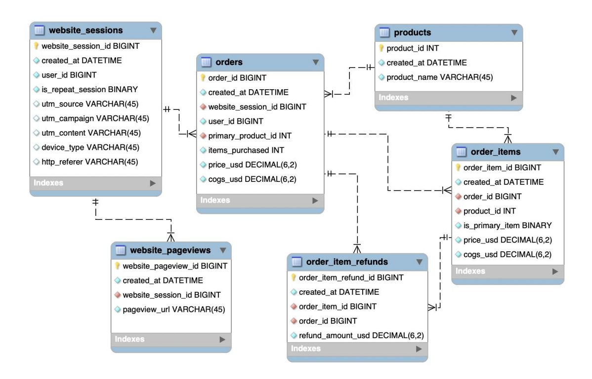 </kbd> <br>
</p>

</details>

<br>

---

## 📂 **Analyzing Traffic Sources**
### **Business Concept**
Traffic source analysis is about understanding **where your customers are 
coming from** and **which channels are driving the highest quality traffic.**

### **Common Use Cases**
- Analyzing search data and shifting budget towards the engines, campaigns or keywords driving the strongest conversion rates
- Comparing user behavior patterns across traffic sources to inform creative and messaging strategy
- Identifying opportunities to eliminate wasted spend or scale high-converting traffic

### **Task**
### **1. Finding Top Traffic Sources**

<p align="center">
  <kbd>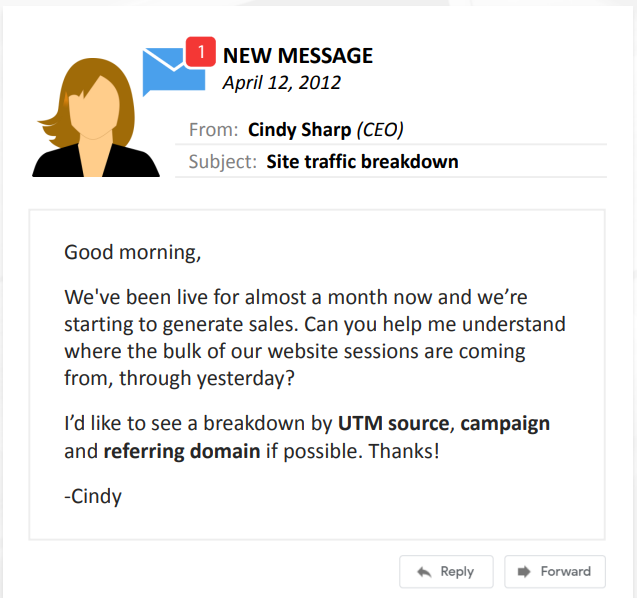 </kbd> <br>
</p>
<br>

**Step :**
- Breakdown of sessions by UTM source, campaign and referring domain
- Filter results up to sessions before **'2012-04-12'** and group results by **utm_source**, **utm_campaign** and **http_referer**
<br>

**Query :**
```sql
SELECT 
	utm_source,
	utm_campaign,
	http_referer,
	COUNT(DISTINCT website_session_id) AS sessions
FROM website_sessions
WHERE created_at < '2012-04-12'
GROUP BY 1, 2, 3
ORDER BY 4 DESC
```
<br>

**Result :**
<p align="center">
  <kbd>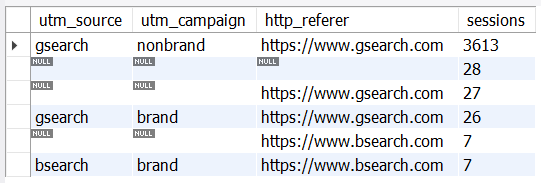 </kbd> <br>
 
  1 — Most sessions came from gsearch nonbrand campaign traffic. Drill deeper to explore potential optimization opportunities.
</p>

<br>

<p align="center">
  <kbd>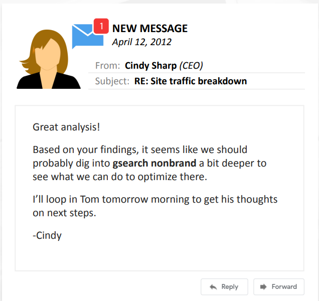 </kbd> <br>
</p>
<br>

### **2. Traffic Conversion Rate**

<p align="center">
  <kbd>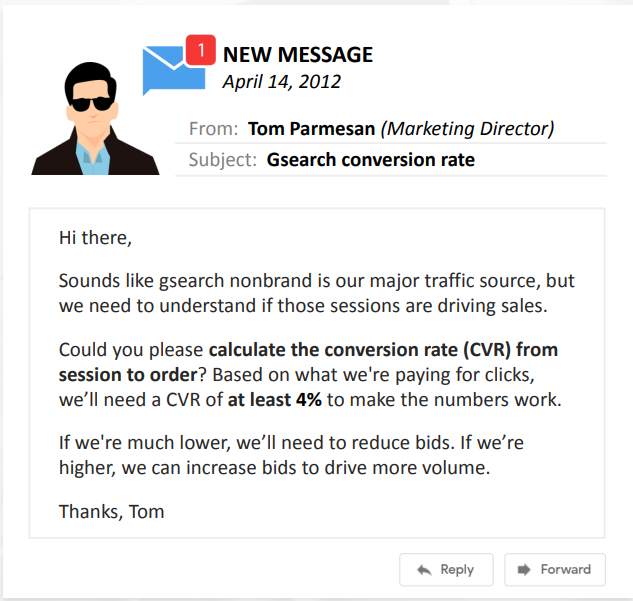 </kbd> <br>
</p>
<br>

**Step :**
- Calculate CVR from **session(COUNT)** to **order(COUNT)**. If CVR < 4% need to reduce bids, otherwise if CVR >= 4% can increase bids to drive more volume
- Filter sessions **< '2012-04-12'**, **utm_source = 'gsearch'** and **utm_campaign = 'nonbrand'**
<br>

**Query :**
```sql
SELECT
	COUNT(DISTINCT w.website_session_id) AS sessions,
	COUNT(DISTINCT o.order_id) AS orders,
	COUNT(DISTINCT o.order_id)/COUNT(DISTINCT w.website_session_id) AS session_to_order_CVR
FROM website_sessions w
	LEFT JOIN orders o
		ON o.website_session_id = w.website_session_id
WHERE w.created_at < '2012-04-14'
	AND utm_source = 'gsearch'
	AND utm_campaign = 'nonbrand'
```
<br>

**Result :**
<p align="center">
  <kbd>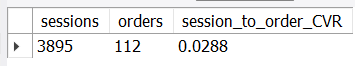 </kbd> <br>
  
  2 — The conversion rate is less than 4%, which is 2.92%, hence we have to reduce bids. We should to monitor impact of bid reduction and analyze performance trending by device type in order to refine bidding strategy.
</p>

<br>

<p align="center">
  <kbd>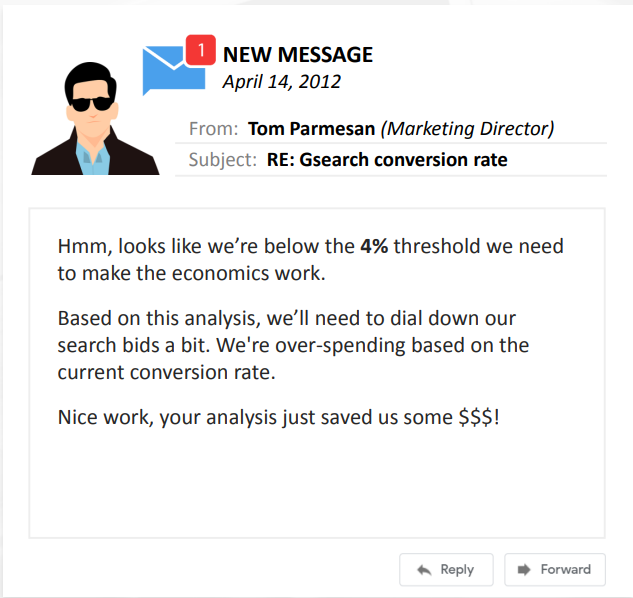 </kbd> <br>
</p>
<br>

### **Business Concept : Bid Optimization**
Analyzing for bid optimization is about **understanding the value of various 
segments of paid traffic, so that you can optimize your marketing budget**.

### **Common Use Cases**
-  Using conversion rate and revenue per click analyses to figure out how much you should spend per click to acquire customers
- Understanding how your website and products perform for various subsegments of traffic (i.e. mobile vs desktop) to optimize within channels 
- Analyzing the impact that bid changes have on your ranking in the auctions, and the volume of customers driven to your site<br>
<br>

### **3. Traffic Source Trending**

<p align="center">
  <kbd>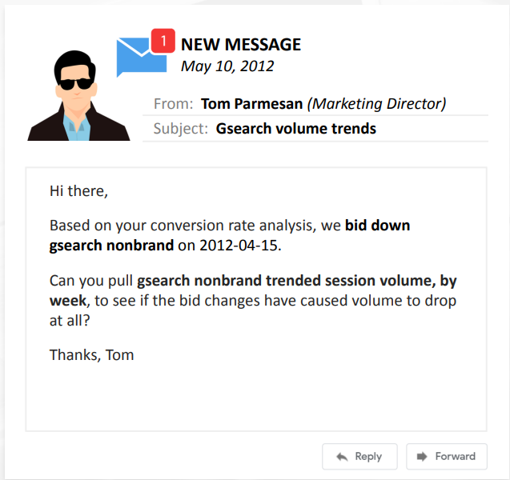 </kbd> <br>
</p>
<br>

**Step :**
- Calculate trend and impact on sessions for gsearch nonbrand campaign after bidding down on Apr 15, 2021
- Filter to **< '2012-05-10'**, **utm_source = 'gsearch'**, **utm_campaign = 'nonbrand'**
<br>

**Query :**
```sql
SELECT
	MIN(DATE(created_at)) AS week_start_date,
	COUNT(DISTINCT website_session_id) AS sessions
FROM website_sessions 
WHERE created_at < '2012-05-10'
	AND utm_source = 'gsearch'
	AND utm_campaign = 'nonbrand'
GROUP BY YEAR(created_at), WEEK(created_at)
```
<br>

**Result :**
<p align="center">
  <kbd>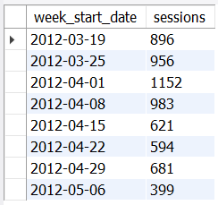 </kbd> <br>
  
  3 — The sessions after 2021-04-15 have dropped. Continue to monitor session volume. We could make the campaigns more efficient to increase volume again, by maximising volume at the lowest possible bid.
</p>

<br>

<p align="center">
  <kbd>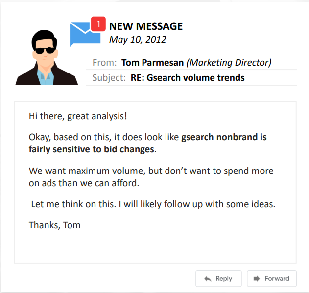 </kbd> <br>
</p>
<br>

### **4. Traffic Source Bid Optimization**

<p align="center">
  <kbd>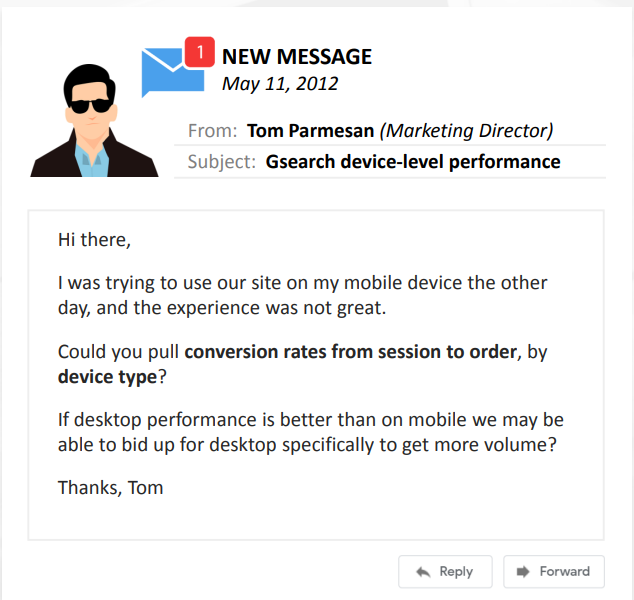 </kbd> <br>
</p>
<br>

**Step :**
- Calculate the conversion rate from session to order by device type
<br>

**Query :**
```sql
SELECT
	w.device_type,
	COUNT(DISTINCT w.website_session_id) AS sessions,
	COUNT(DISTINCT o.order_id) AS orders,
	COUNT(DISTINCT o.order_id)/COUNT(DISTINCT w.website_session_id) AS session_to_order_CVR
FROM website_sessions w
	LEFT JOIN orders o
		ON o.website_session_id = w.website_session_id
WHERE w.created_at < '2012-05-11'
	AND w.utm_source = 'gsearch'
	AND w.utm_campaign = 'nonbrand'
GROUP BY 1
ORDER BY 4 DESC
```
<br>

**Result :**
<p align="center">
  <kbd> </kbd> <br>
  
  4 — Desktop bids were driving nearly 4% of the conversion rate, so we should transfer the paid traffic spent to the desktop channel instead.
</p>

<br>

<p align="center">
  <kbd>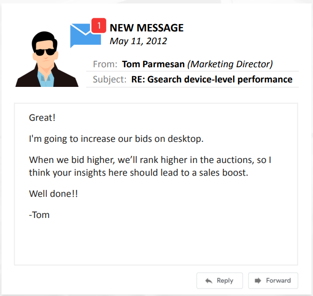 </kbd> <br>
</p>
<br>

### **5. Traffic Source Segment Trending**

<p align="center">
  <kbd>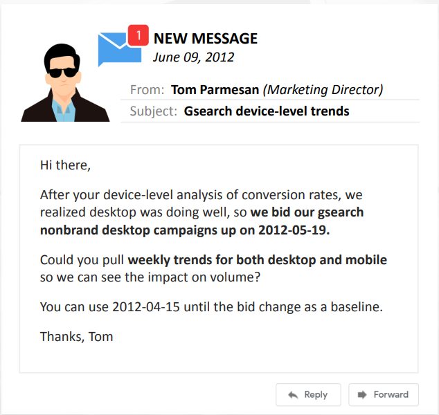 </kbd> <br>
</p>
<br>

**Step :**
- Calculate (with pivot)  weekly session trends for both desktop and mobile after bidding up on the desktop channel on 2012-05-19
- Filter to **between '2012-04-15' to '2012-06-19'**, **utm_source = 'gsearch'**, **utm_campaign = 'nonbrand'**
<br>

**Query :**
```sql
SELECT
	MIN(DATE(created_at)) AS week_start_date,
	COUNT(DISTINCT CASE WHEN device_type = 'desktop' THEN website_session_id ELSE NULL END) AS dtop_session,
	COUNT(DISTINCT CASE WHEN device_type = 'mobile' THEN website_session_id ELSE NULL END) AS mob_session
FROM website_sessions
WHERE created_at < '2012-06-09'
	AND created_at > '2012-04-15'
	AND utm_source = 'gsearch'
	AND utm_campaign = 'nonbrand'
GROUP BY YEAR(created_at), WEEK(created_at)
```
<br>

**Result :**
<p align="center">
  <kbd>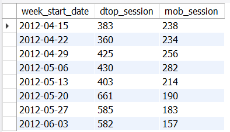 </kbd> <br>
  
  5 — Desktop volume increased after bidding on 2012-05-19, but mobile volume dropped dramatically. Focusing on desktops was able to optimize spending efficiently. Continue to monitor device-level volume and be aware of the impact bid levels has. Continue to monitor conversion performance at the device-level to optimize spend.
</p>

<br>

<p align="center">
  <kbd>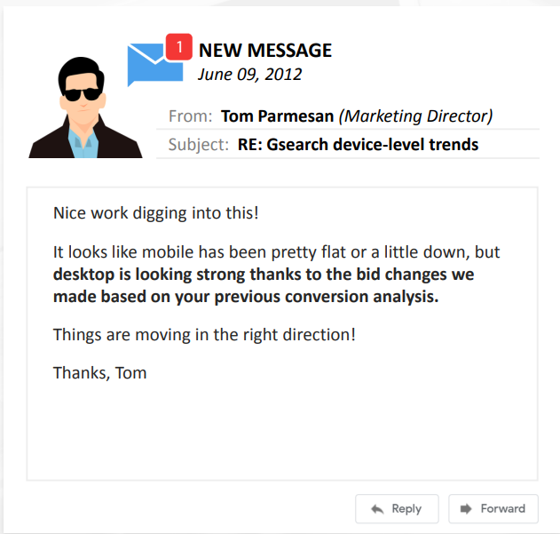 </kbd> <br>
</p>
<br>

---

## 📂 **Analyzing Website Performance**
